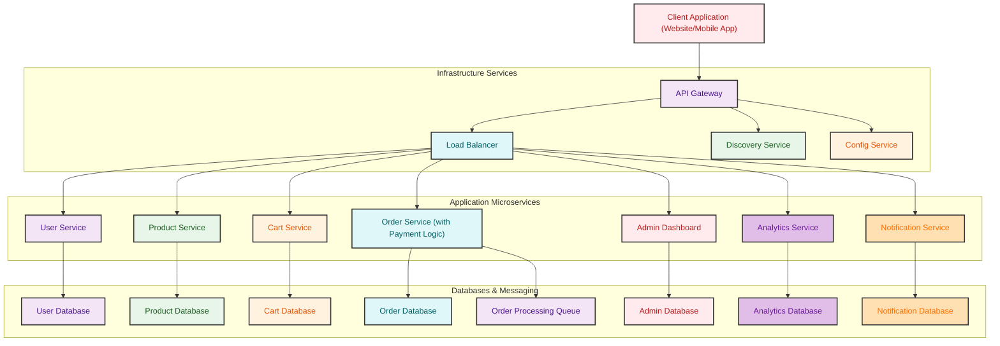

# E-Commerce Platform

# Table of Contents

1. [Overview](#1-overview)
2. [Features](#2-features)
3. [Technologies Used](#3-technologies-used)
4. [Prerequisites](#4-prerequisites)
5. [Architecture Diagram](#5-architecture-diagram)
6. [Module Overview](#6-module-overview)
   * [Discovery Server (Eureka)](#discovery-server-eureka)
   * [API Gateway](#api-gateway)
   * [User Authentication and Profile Management Module](#user-authentication-and-profile-management-module)
   * [Admin Dashboard Module](#admin-dashboard-module)
   * [Product Management Module](#product-management-module)
   * [Shopping Cart Module](#shopping-cart-module)
   * [Order Management Module](#order-management-module)
   * [Notification Service](#notification-service)
   * [Analytics Service](#analytics-service)
8. [Deployment Strategy](#7-deployment-strategy)
   * [Local Deployment](#local-deployment)
9. [Database Design](#8-database-design)
   * [Tables and Relationships](#tables-and-relationships)
10. [User Interface Design](#9-user-interface-design)
   * [Wireframes](#wireframes)
11. [Module Setup Instructions](#10-module-setup-instructions)
12. [Testing](#11-testing)
   * [Unit Testing](#unit-testing)


## 1. Overview

This E-Commerce Platform allows users to browse products, manage shopping carts, order and make payments. It includes an admin interface for managing products, orders, users, and analytics. The platform supports Java (Spring Boot) for backend development and React for frontend development.

## 2. Features

- **Product Management**: Create, update, delete, and categorize products.
- **Shopping Cart**: Add, remove, and manage items in the shopping cart.
- **Order Management**: Process customer orders and manage payments.
- **User Authentication and Profile Management**: User registration, login, profile updates, and password management.
- **Admin Dashboard**: Manage users, products, and view analytics on sales and user activity.
- **Analytics**: Track sales, user activity, and generate reports.
- **Notifications**: Email notifications for order status and user actions.

## 3. Technologies Used

- **Frontend**: React
- **Backend**: Java (Spring Boot)
- **Database**: MySQL
- **Architecture**: REST API-based microservices
- **Other**: Eureka (Service Discovery), API Gateway, Feign Clients, Maven, Node.js

## 4. Prerequisites

Before setting up and running this project, ensure you have the following installed and configured:

### System Requirements

- **Java 17+** - Required for Spring Boot microservices
- **Node.js 18+** - Required for React frontend
- **Maven 3.8+** - For building Java projects
- **MySQL 8+** - Relational database for services
- **Git** - For version control

## 5. Architecture Diagram



## 6. Module Overview

### Discovery Server (Eureka)
- Acts as a service registry where all microservices register themselves.
- Enables dynamic service discovery and communication within the ecosystem.

### API Gateway
- Provides a unified entry point to route incoming client requests to appropriate microservices.
- Handles load balancing, logging, and cross-cutting concerns.

### User Authentication and Profile Management Module
- **Features**: User registration and login functionality, profile updates.
- **Entities**: User (UserID, Name, Email, Password, ShippingAddress, PaymentDetails)

[User Authentication and Profile Management Module](https://github.com/yadavkamal081/E-Commerce/blob/main/README.md) - [Kamal Yadav]

### Admin Dashboard Module
- **Features**: Manage products, view order statuses, customer details, generate sales analytics and reports.
- **Entities**: Admin (AdminID, Name, Role, Permissions)
  
### Product Management Module
- **Features**: Manage product listings, including creation, updates, and categorization.
- **Entities**: Product (ProductID, Name, Description, Price, Category, ImageURL)

[Product Management Module](https://github.com/Santhoshram7077/E-Commerce/blob/main/README.md) - [Santhoshram]  

### Shopping Cart Module
- **Features**: Add/remove products to/from the shopping cart, view items and total price. 
- **Entities**: CartItem (CartItemID, ProductID, Quantity, TotalPrice)

[Shopping Cart Module](https://github.com/ACHYUTH-S-11/E_Commerce/blob/main/README.md) - [Achyuth]

### Order Management Module 
- **Features**: Place orders with shipping details, payment processing.
- **Entities**: Order (OrderID, UserID, TotalPrice, ShippingAddress, OrderStatus, PaymentStatus)

[Order Management Module](https://github.com/amritanshusingh2/order-management-module/blob/main/order-management-module/README.md) - [Amritanshu]

### Notification Service
- **Features**: Sends email notifications for order status updates and user actions.
- **Entities**: ContactMessageRequest (Email, Subject, Message)

### Analytics Service
- **Features**: Provides analytics on sales, user activity, and generates reports for the admin dashboard.
- **Entities**: DashboardStats (Sales, Users, Orders, Revenue, etc.)

## 7. Deployment Strategy

### Local Deployment

- **Frontend**: Served using local servers (e.g., `npm start` for React).
- **Backend**: Deployed locally using Spring Boot (`mvn spring-boot:run`).
- **Database**: Local instance of MySQL for testing.

## 8. Database Design

### Tables and Relationships

- **Product**: Primary Key: ProductID
- **User**: Primary Key: UserID
- **CartItem**: Primary Key: CartItemID, Foreign Key: ProductID
- **Order**: Primary Key: OrderID, Foreign Key: UserID
- **Admin**: Primary Key: AdminID

## 9. User Interface Design

### Wireframes

- Product Listing Page
- Shopping Cart Page
- Order Confirmation Page
- User Profile Management Page
- Admin Dashboard

## 10. Module Setup Instructions

### Frontend (React)

1. **Install Dependencies**:
   ```bash
   npm install
   ```
2. **Start Development Server**:
   ```bash
   npm start
   ```

### Backend (Spring Boot)

1. **Build Project**:
   ```bash
   mvn clean install
   ```
2. **Run Application**:
   ```bash
   mvn spring-boot:run
   ```

### Database

1. **Setup Database**:
   - Create a MySQL database instance.
   - Configure database connection settings in the backend application properties.

## 11. Testing

### Unit Testing

- **Backend**: Use JUnit and Mockito.
  ```bash
  mvn test
  ``` 
